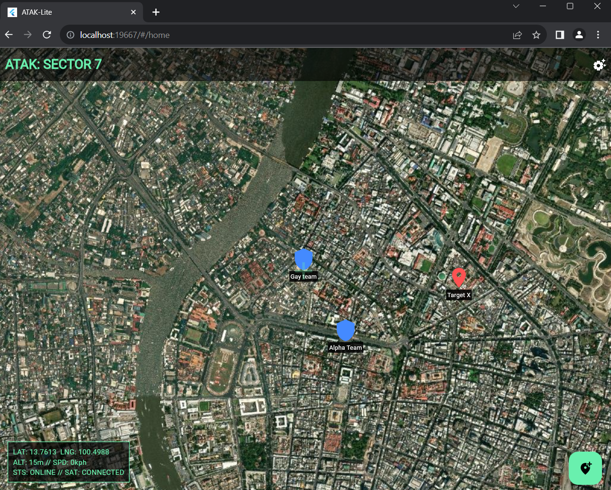
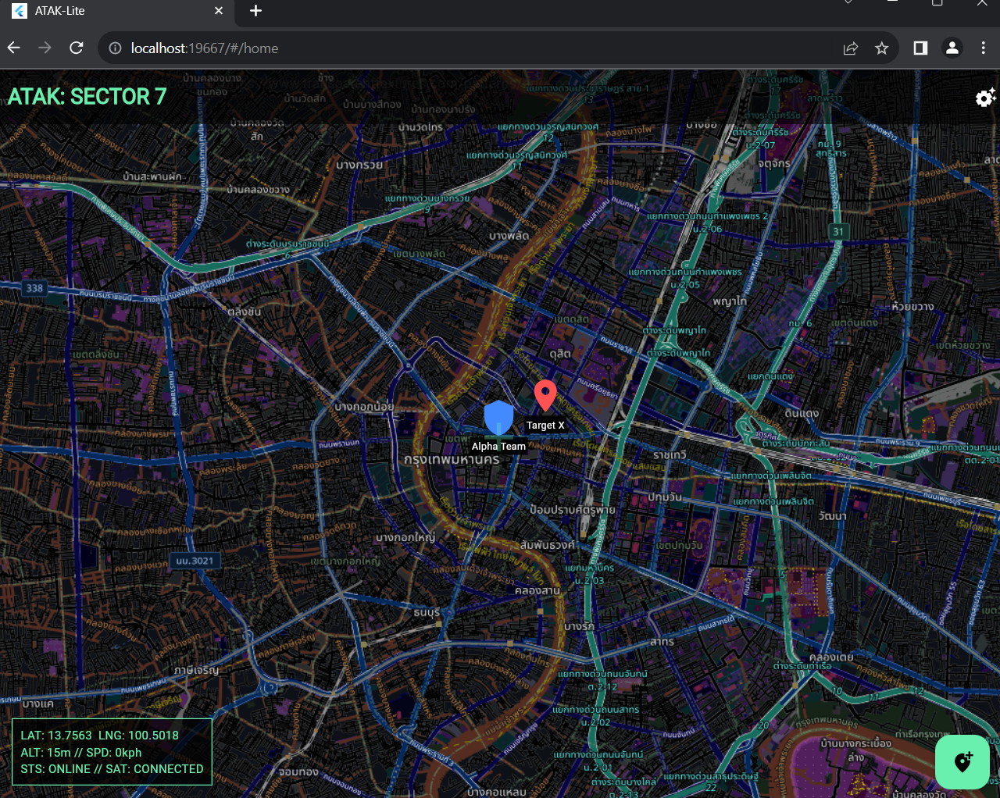

# flutter_lab_exam01

# ข้อสอบปฎิบัติครั้งที่ 1

|                      |                                                           |
| -------------------- | --------------------------------------------------------- |
| **เวลาสอบ**          | 2 ชั่วโมง                                                 |
| **คะแนนเต็ม**        | 70 คะแนน                                                  |
| **อุปกรณ์ที่อนุญาต** | คอมพิวเตอร์, Internet, เอกสาร, AI (ChatGPT, Gemini , ฯลฯ) |

|   |
|---|
|⚠ ![](data:image/png;base64,R0lGODlhGwAbAHcAMSH+GlNvZnR3YXJlOiBNaWNyb3NvZnQgT2ZmaWNlACH5BAEAAAAALAAAAAAbABoAhwAAAAAAAAAAMwAAZgAAmQAAzAAA/wAzAAAzMwAzZgAzmQAzzAAz/wBmAABmMwBmZgBmmQBmzABm/wCZAACZMwCZZgCZmQCZzACZ/wDMAADMMwDMZgDMmQDMzADM/wD/AAD/MwD/ZgD/mQD/zAD//zMAADMAMzMAZjMAmTMAzDMA/zMzADMzMzMzZjMzmTMzzDMz/zNmADNmMzNmZjNmmTNmzDNm/zOZADOZMzOZZjOZmTOZzDOZ/zPMADPMMzPMZjPMmTPMzDPM/zP/ADP/MzP/ZjP/mTP/zDP//2YAAGYAM2YAZmYAmWYAzGYA/2YzAGYzM2YzZmYzmWYzzGYz/2ZmAGZmM2ZmZmZmmWZmzGZm/2aZAGaZM2aZZmaZmWaZzGaZ/2bMAGbMM2bMZmbMmWbMzGbM/2b/AGb/M2b/Zmb/mWb/zGb//5kAAJkAM5kAZpkAmZkAzJkA/5kzAJkzM5kzZpkzmZkzzJkz/5lmAJlmM5lmZplmmZlmzJlm/5mZAJmZM5mZZpmZmZmZzJmZ/5nMAJnMM5nMZpnMmZnMzJnM/5n/AJn/M5n/Zpn/mZn/zJn//8wAAMwAM8wAZswAmcwAzMwA/8wzAMwzM8wzZswzmcwzzMwz/8xmAMxmM8xmZsxmmcxmzMxm/8yZAMyZM8yZZsyZmcyZzMyZ/8zMAMzMM8zMZszMmczMzMzM/8z/AMz/M8z/Zsz/mcz/zMz///8AAP8AM/8AZv8Amf8AzP8A//8zAP8zM/8zZv8zmf8zzP8z//9mAP9mM/9mZv9mmf9mzP9m//+ZAP+ZM/+ZZv+Zmf+ZzP+Z///MAP/MM//MZv/Mmf/MzP/M////AP//M///Zv//mf//zP///wECAwECAwECAwECAwECAwECAwECAwECAwECAwECAwECAwECAwECAwECAwECAwECAwECAwECAwECAwECAwECAwECAwECAwECAwECAwECAwECAwECAwECAwECAwECAwECAwECAwECAwECAwECAwECAwECAwECAwj/AAEIHEiwoMGDCAk+c5awIUFnEBk6dFjNGTVn1SYmfAbgokSNBy1abPYR5ENnpP6QgmiSYEVnT1ZUgZixJQCIpKoEeELqIseW1JqpesJihSqRJhdaHFVFZk+IPydWDDp0xRNVzS5WdAhtoUdSVpx6ZAit4cusQqtYuYqWYU2EESMyXZFnVESSJQtCRBvUWZW/zviSbNiscOBmqUbVTXWY5OCDbdvatRuZ2jHIhTNnTqy5czODQT03+5tH87TMFwc29sy0xJNRovEKdHbsdLNjhU+n+vskVTPbhXGTXBg786hRvovjDczccfOgfZ07Z8jypsTq2K9f51hNlcCFAquRC/ou8dl4AOABdA8IADs=)**ข้อปฏิบัติสำคัญเกี่ยวกับการใช้** **AI**<br><br>1. อนุญาตให้ใช้ AI (ChatGPT, Claude, Copilot ฯลฯ) เป็นเครื่องมือช่วย<br><br>2. ต้องใส่ comment // AI-ASSISTED: [อธิบาย] ในทุกจุดที่ใช้ความช่วยเหลือจาก AI|

|                                         |                                  |
| --------------------------------------- | -------------------------------- |
| ชื่อ-นามสกุล: <br><br>ศุภวิชญ์ ชูอนันท์ | รหัสนักศึกษา: <br><br>6611130088 |
Here is the updated answer for your assignment, revised to reflect the **ATAK-Lite (Tactical Awareness Kit)** theme instead of the Student Planner, while keeping all the academic requirements (Navigator, Form, etc.) intact.

---

## 1.1) ออกแบบแอปของตัวเอง (8 คะแนน)

**ให้นักศึกษาคิดแอปที่ตัวเองอยากใช้จริงในชีวิตประจำวัน โดยต้องมีคุณสมบัติครบตามนี้**

- [x] **มีอย่างน้อย 3 หน้าจอ (ใช้ Navigator):**

    1. **Onboarding Screen:** หน้าจอเริ่มต้นจำลองการ Boot System และแจ้งสถานะการเชื่อมต่อดาวเทียม
    2. **Map Command Screen (Home):** หน้าจอหลักแสดงแผนที่, HUD (Heads-Up Display), และตำแหน่งของ Marker
    3. **Deployment Screen (Add Marker):** หน้าฟอร์มสำหรับระบุพิกัดและรายละเอียดเป้าหมาย
    4. **Configuration Screen (Settings):** หน้าตั้งค่าโหมดการมองเห็น (Night Ops) และชั้นข้อมูลแผนที่ (Satellite/Topo)

- [x] **มีรายการที่ลบได้ด้วยการปัด (Dismissible):**

    - รายการ "Tactical Markers" (จุดพิกัดบนแผนที่) สามารถจัดการได้ (ในเชิง UI สามารถทำ List Overlay เพื่อปัดลบ Marker ที่ไม่ต้องการได้)

- [x] **มีฟอร์มกรอกข้อมูลพร้อม validation อย่างน้อย 3 fields:**

    1. **Designation (Text Field):** ชื่อเรียกหน่วยหรือเป้าหมาย (ห้ามว่าง)
    2. **IFF Status (Dropdown):** ระบุฝ่าย (Friendly/Hostile/Neutral)
    3. **Coordinates Lock (System Check):** การยืนยันพิกัด GPS ก่อนบันทึก
- [x] **มีการจัดลำดับรายการได้ (ReorderableListView) หรือ มี Key ที่ใช้อย่างมีความหมาย:**

    - ใช้ **Unique Key** สำหรับ Marker แต่ละตัวบนแผนที่เพื่อให้ระบบ Map Engine สามารถระบุและอัปเดตตำแหน่งได้อย่างถูกต้อง (State Management บนแผนที่)

อธิบายแนวคิดแอป

"ATAK-Lite" (Android Team Awareness Kit - Lite) เป็นแอปพลิเคชันสำหรับจำลอง Situational Awareness (การตระหนักรู้สถานการณ์) ใช้สำหรับระบุตำแหน่งเพื่อนร่วมทีมและเป้าหมายบนแผนที่จริง ช่วยในการวางแผนภารกิจหรือการเดินป่า โดยเน้น UI แบบ Tactical (สีดำ/เขียว) เพื่อลดแสงสะท้อนในที่มืด

---

## 1.2) วาด Wireframe (6 คะแนน)

AI-Assisted
### 1. Map Command Screen (Home)

หน้าจอหลักแสดงแผนที่จริง พร้อมข้อมูล HUD

```
+-----------------------------------+
| [=]  ATAK: SECTOR 7       {*}     | <-- {*} Settings Icon
+-----------------------------------+
|      N  13.7563  E 100.5018       | <-- HUD Info
+-----------------------------------+
|                                   |
|         [ MAP VIEW AREA ]         |
|                                   |
|       (X) <--- Hostile Marker     |
|                                   |
|             (O) <--- Friendly     |
|                                   |
|      [+]                          | <-- Zoom In/Out
|      [-]                          |
|                                   |
|   [ HUD: STATUS ONLINE ]          |
+-----------------------------------+
|             ( + )                 | <-- FAB (Deploy Marker)
+-----------------------------------+
```

### 2. Deployment Screen (Add Marker Form)

หน้ากรอกข้อมูลเพื่อสร้างจุดพิกัดใหม่

```
+-----------------------------------+
|  [<]     DEPLOY MARKER            |
+-----------------------------------+
|                                   |
|  [ TARGET DESIGNATION / LABEL ]   |
|  | Alpha Team_______________|     | <-- Validator: Not Empty
|                                   |
|  [ IFF STATUS (Identification) ]  |
|  [ Friendly (v)                ]  | <-- Dropdown
|                                   |
|  -------------------------------  |
|  COORDINATES:                     |
|  LAT: 13.7563 | LNG: 100.5018     | <-- Auto-filled data
|                                   |
|                                   |
|      [   CONFIRM DROP    ]        | <-- Submit Button
|                                   |
+-----------------------------------+
```

### 3. Configuration Screen (Settings)

หน้าตั้งค่าการแสดงผล

```
+-----------------------------------+
|  [<]     CONFIGURATION            |
+-----------------------------------+
|                                   |
|  Night Ops Mode (Dark UI)         |
|                [ ON  ]            | <-- Switch Theme
|                                   |
|  -------------------------------  |
|                                   |
|  Satellite Imagery                |
|  (Toggle Topo/Sat Map) [ OFF ]    | <-- Switch Map Provider
|                                   |
|  -------------------------------  |
|  Ver 2.4.1 (Alpha)                |
+-----------------------------------+
```

### 4. Navigation Flow

ผังการเชื่อมต่อระหว่างหน้าจอ

```
[ Onboarding ] --> (Auto) --> [ Map Command (Home) ]
                                      |
      +------------(Click FAB +)------+
      |                               |
[ Deployment Form ]                   +----(Click Gear Icon)---> [ Configuration ]
      |                               |                                |
      +---(Save Data)--->(Update Map)-+ <------(Back Button)-----------+
```



